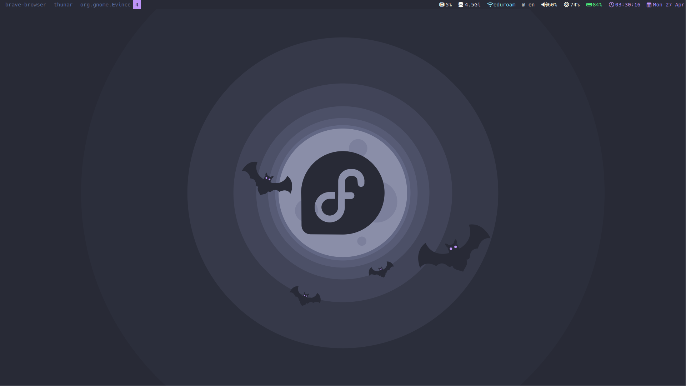
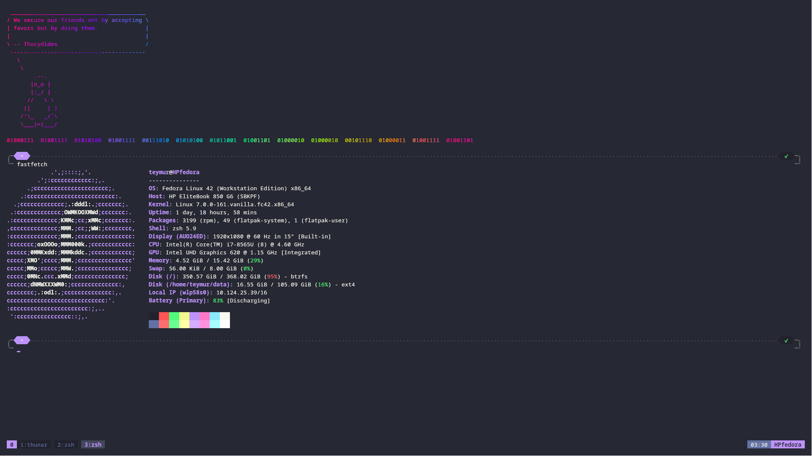
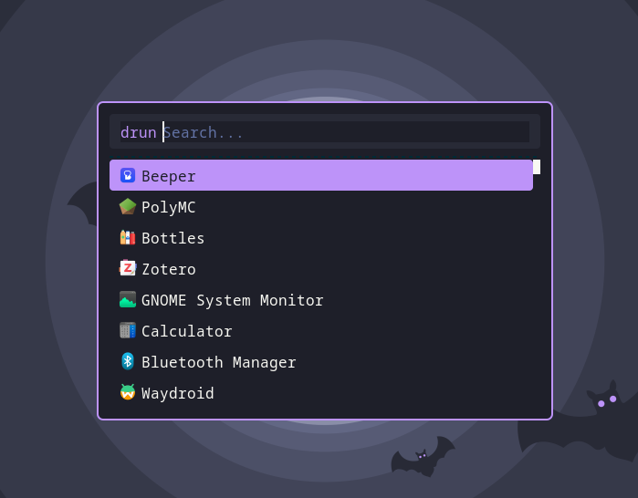

# Teymur's dotfiles

## Images
](images/neovim.png)
Neovim dashboard modified version of [DaiterGG/neovim-config](https://github.com/DaiterGG/neovim-config/blob/main/lua/custom/plugins/alpha.lua)

Desktop dracula [wallpaper](https://github.com/dracula/wallpaper/blob/master/first-collection/fedora.png)

neofetch (also there is a goku logo but removed that cause didnt work in kitty)

<br> rofi drun app launcher
## Requirements

| Package | Needed for |
|---------|-----------|
| `swaylock` + `swayidle` | Lock / idle (`$super+l`, auto-lock) |
| `grimshot` | Screenshots |
| `wl-clipboard` + `cliphist` | Clipboard history (`$super+Shift+V`) |
| `i3blocks` | Bar status scripts |
| `wpctl` (pipewire) | Volume keys |
| `brightnessctl` | Brightness keys |
| `jq` + `dmenu` | Workspace rename (`$super+,`) |
| `brave-browser` | `$super+w` |
| `thunar` | `$super+e` |
| `powerlevel10k` | Zsh prompt (clone to `~/powerlevel10k`) |
| `zsh-autocomplete` | Zsh completions (clone to `~/zsh-autocomplete`) |
| `fortune` + `cowsay` + `lolcat` + `figlet` | Zsh startup splash |
| `thefuck` | Shell command correction |
| `vim-plug` | Neovim plugin manager (bundled in repo) |
| `pip3` | Neovim jupynium install |
| Hack Nerd Font, Poppins, Ionicons | Waybar / sway fonts |
| `whiptail` or `dialog` | `install.sh` TUI |

## Contents

| Config | Path |
|--------|------|
| Bash | `.bashrc`, `.bash_aliases` |
| Zsh | `.zshrc`, `.p10k.zsh` |
| Tmux | `.tmux.conf` |
| Neovim | `.config/nvim/init.vim` |
| Fastfetch | `.config/fastfetch/` |
| Sway/i3 | `.config/i3/` |
| Waybar | `.config/waybar/` |
| Rofi | `.config/rofi/` |
| Kitty | `.config/kitty/kitty.conf` |

## Keymaps

> `$super` = Super/Win key, `$alt` = Alt key

### General
| Keybind | Action |
|---------|--------|
| `$super+Return` | Terminal (kitty + tmux) |
| `$super+d` | App launcher (rofi drun) |
| `$super+Shift+d` | File browser (rofi) |
| `$super+Shift+V` | Clipboard history (cliphist + rofi) |
| `$super+c` / `$alt+F4` | Kill focused window |
| `$super+BackSpace` | Reload sway config |
| `$super+q` | Exit sway |

### Apps & System
| Keybind | Action |
|---------|--------|
| `$super+w` | Brave browser |
| `$super+e` | Thunar file manager |
| `$super+l` | Lock screen |
| `ctrl+$super+l` | Suspend |
| `Print` | Screenshot area (save) |
| `$alt+Print` | Screenshot area (clipboard) |

### Media
| Keybind | Action |
|---------|--------|
| `XF86AudioRaiseVolume` | Volume +5% |
| `XF86AudioLowerVolume` | Volume -5% |
| `XF86AudioMute` | Toggle mute |
| `XF86MonBrightnessUp` | Brightness +5% |
| `XF86MonBrightnessDown` | Brightness -5% |

### Window Management
| Keybind | Action |
|---------|--------|
| `$super+Arrow` | Focus direction |
| `$super+Shift+Arrow` | Move window |
| `$super+h` / `$super+v` | Split horizontal/vertical |
| `$super+s` | Toggle split layout |
| `$super+f` | Fullscreen toggle |
| `$super+space` | Toggle floating |
| `$super+Shift+space` | Focus mode toggle |
| `$super+r` | Resize mode |
| `$super+minus` | Show scratchpad |
| `$super+Shift+minus` | Move to scratchpad |
| `$super+p` | Cycle HDMI position (above → right → below → left) |

### Workspaces
| Keybind | Action |
|---------|--------|
| `$super+1–0` | Switch to workspace 1–10 |
| `$super+Shift+1–0` | Move window to workspace 1–10 |
| `$alt+Tab` | Next workspace |
| `$alt+Shift+Tab` | Prev workspace |
| `$super+comma` | Rename workspace |

## Usage

These are highly personal you'll need to edit them before use especially `.bashrc` and `.bash_aliases` (paths, usernames, aliases).

To install configs interactively (requires `whiptail` or `dialog`):

```bash
./install.sh
```

Existing files are backed up as `*.bak` before overwriting.

To sync your own configs into this repo run:

```bash
./.update_files.sh
```
